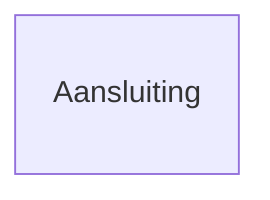
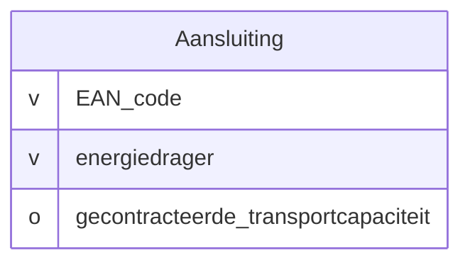
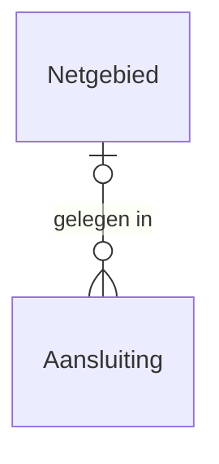
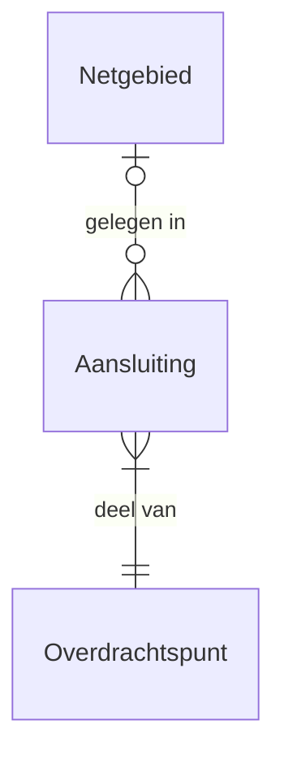
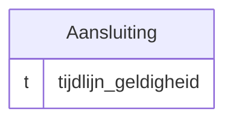

# Wegwijs in de modellen
{: .no_toc }

## Inhoud
{: .no_toc .text-delta }
1. TOC
{:toc}

De conceptuele informatiemodellen op deze website gebruiken eenvoudige diagrammen om te laten zien _welke begrippen er zijn_ en _hoe die met elkaar samenhangen_. Hieronder leggen we de belangrijkste elementen uit.

## Entiteiten

Een **entiteit** is iets uit de werkelijkheid waarover we informatie vastleggen, bijvoorbeeld een aansluiting, een meter of een klant. In het diagram zie je entiteiten als **rechthoeken** met een naam erin.

## Eigenschappen

Elke entiteit heeft eigenschappen: kenmerken die beschrijven wat iets is of hoe het zich gedraagt. Die staan in het model onder de entiteitsnaam.  
Voorbeeld: een `Aansluiting` heeft een `EAN_code` en een `energiedrager` (elektriciteit of gas).

## Relaties

Entiteiten hangen vaak met elkaar samen. Zo liggen in een **netgebied** één of meer **aansluitingen**. Dat zie je als een lijn tussen twee entiteiten, met een naam erbij.

De positie van het label (bij `Aansluiting`) laat de richting van de relatie zien.

## Multipliciteit

Crow’s foot notation gebruikt symbolen om aan te geven hoeveel elementen aan elke kant van de relatie voorkomen. Daarbij staat een cirkel voor 0, een streep voor 1 en een driepoot voor veel. In paren geven zij het minimum en maximum aan:

- `||` betekent: precies één (minimaal en maximaal 1)
- `o|` betekent: nul of één
- `o{` betekent: nul of meer
- `|{` betekent: één of meer

Bijvoorbeeld:

- `}o--o|` → Nul of meer aansluitingen kunnen in één netgebied liggen
- `}|--||` → Eén of meer overdrachtspunten zijn deel van exact één aansluiting

## Tijdsaspecten

Sommige gegevens veranderen in de tijd. Denk aan een aansluiting die van status verandert of een klant die verhuist. Als het model dat soort tijdinformatie bevat, zie je annotaties als:

- `tijdlijn geldigheid`
- `tijdlijn levensduur`

Deze geven aan in welke periode een gegeven geldig is. Dit noemen we ook wel een tijdlijn of *tijdslijnmodellering* (NEN 3610).

## TODO
{: .no_toc }

- essentiële versus accidentiële eigenschappen (multipliciteit)
- afleidbare elementen
- verwijzingen naar andere modellen (grijs)
- NBility-kleuren

Meer voor modelleurs dan modellezers:

- naamgevingsconventies
- notatieconventies
- Barker's naamgevingspatroon voor relaties
- Juriconnect
- LinkML-specifieke conventies
